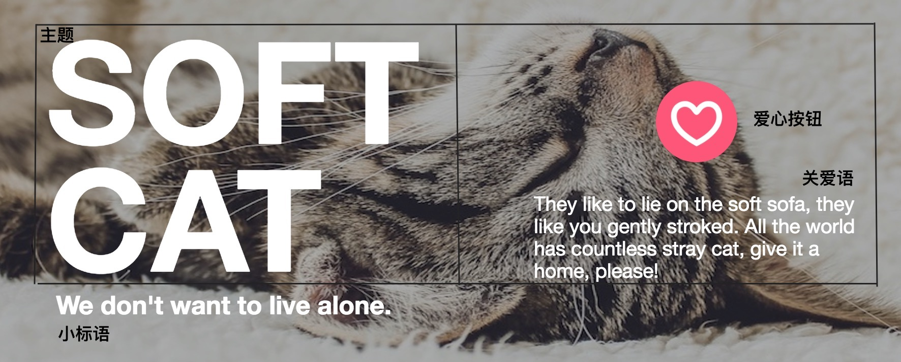

自主设计构建的一个"关爱流浪猫"官网的封面页。

我们先来看一下页面效果：

### 页面描述

页面整体为 "现代 欧美 清新 简约" 的风格。

进入网站最夺人眼球的是网站中间用白色粗体的大字凸显出的网站主旨——"Soft Cat"，其次就是符合主题的背景图，我选用了一只躺在毛毯上的小猫，同时为背景作了半透明处理，为了用户能够看清白色的文字。

网站整体的颜色再搭配文字，给用户的第一感觉是简约又大方，而纯净的页面中那粉色的心形标志就更显得夺目，使用户会不由自主的把目光移到那里。

简单的页面就要搭配少量的文字，字多了排版也是问题，而且用户会产生反感，不想去阅读和浏览。我通过文字的大小粗细进行排版，使用户能很快的分清楚文字的布局，从少量的文字中明白这个网站是干什么的！

现在我分解展示一下这个网站的各个部分：

### LOGO

网站Logo我用了我自己的名字，并没有加入图片，因为这个字体已经很好看了。一个页面的Logo是很重要的，它是网站的门面，也是别人能否记住你是谁的决定性因素！
这里我使用了`Pacifico`字体，并且在字母间作了间隔，目的是可以让用户更清楚的看到每个字母并记住它。

font-family: Pacifico, Snell Roundhand;
font-weight: 500;
letter-spacing: 3px;


### Nav

网站导航也是很重要的，要让用户能够看明白导航可以带他去到哪里，和我身处什么位置。相对于这种简洁的页面，导航需要至少两种状态：鼠标移上和点击后。

下面是这两种状态的样式效果：

页面层次多的最好使用"面包屑"导航，或者在这个基础上构建二级导航，给用户一个好的浏览体验。

### 主体

这个部分是网站的精髓所在，你要告诉用户，这是关于什么的网站？可以干什么？它包括了网站的主旨、标语、关爱语和心型按钮：

在样式中，我使用了`flex`布局，可以响应各种尺寸的屏幕，用过一次就爱上了它。页面中的文字可以根据实际情况做更改，样式布局也可以随心所欲，重点是在没有使用边框的时候，你应该能让用户区分出文字的排版。

在页面中我添加了一个小动效，使网站使用起来不枯燥。就是粉色的心型按钮，点击后会3D旋转三圈，然后提示用户"Thank for you"。无论在使用中它的作用是筹款，还是点赞，我只是无聊添加个小玩意。可以看源代码，其实只有6行。
